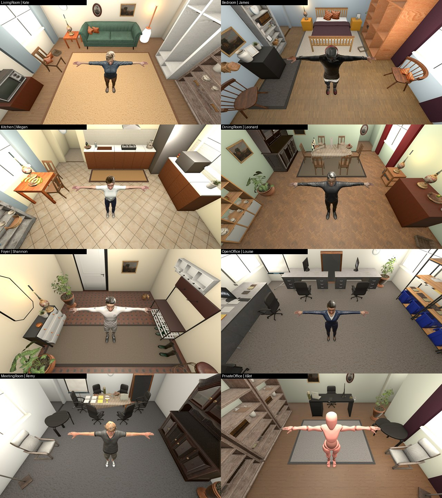
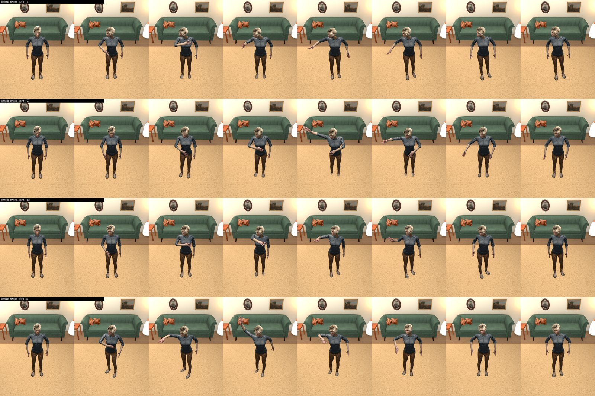
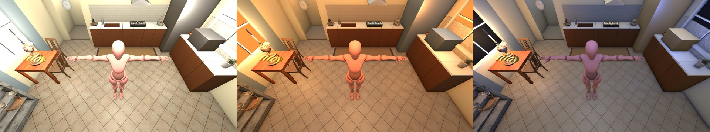

# GestureMotionPOC: synthetic gesture-dataset environments in Unity

A Unity 6 (URP) project that renders **swipe-left / swipe-right / idle** motion clips on humanoid characters inside
furnished rooms, from a fixed camera that keeps both hands in frame. The rendered frames are training data for the
MagicMirror gesture classifier (see `../../gesture_system`).

**Why:** the classifier scores about 87 % balanced accuracy in cross-validation but only about 65 % on a recording
session it has never seen (swipe-right is the weak class at 40 %), which points to domain shift. Rendering the same
motions in many rooms, lighting conditions and bodies is the fix under test.

## Status

| Part | State |
|---|---|
| 8 indoor zones (living room, bedroom, kitchen, dining room, foyer, open office, meeting room, private office) | done, validated, lightmaps baked |
| 7 lighting presets per zone (morning, midday, daylight, overcast, evening, night, artificial) | done |
| 10 humanoid characters (XBot + 9 scaled to 1.65 to 1.85 m) | done |
| 291 motion clips (Kimodo, converted from BVH) + clip viewer | done, reviewed |
| Outdoor zones (backyard, front yard, terrace, street) | **not built**: `Zone.outdoor` mode exists but is untested |
| `BatchDatasetGenerator` looping over zones x presets x characters x clips | **not done**: still the old prefab-based loop, 1280x720, no anti-aliasing |
| Bathroom | dropped on purpose |

The full build log (every decision, bug and fix) is in [`../../docs/environment-build.md`](../../docs/environment-build.md).

## Set up (a fresh clone)

1. **Unity 6000.6.2f1** with the Universal Render Pipeline. On Apple Silicon, lightmap baking needs Rosetta
   (`softwareupdate --install-rosetta`), then restart Unity.
2. **Import the three free Asset Store packs** through *Package Manager > My Assets* (they are not in this repo,
   because their licence forbids redistribution): *Furniture Mega Pack - Free* (dlgames), *House Interior - Free*
   (nappin), *Office Room Furniture* (Elcanetay). Links are in `Assets/Environments/CREDITS.md`.
   Their GUIDs are stable, so scenes and prefabs relink automatically.
3. **Download the CC0 Poly Haven assets** (about 2 GB): `python3 tools/download_polyhaven.py` from the repo root.
   Safe to re-run; the `.meta` files are already committed so references keep their GUIDs.
4. Open the project, wait for the import, open `Assets/Scenes/DatasetWorld.unity`.
5. The Elcanetay office pack and nappin pack use built-in materials. If they look pink, convert them to URP
   (*Window > Rendering > Render Pipeline Converter*). Only pack materials are affected.

## Watch the clips

Open `Assets/Scenes/ClipViewer.unity` and press **Play**.

| Key | Action |
|---|---|
| Left / Right | previous / next clip (or use the on-screen buttons) |
| Space | pause |
| L | loop on/off |
| Up / Down | playback speed |
| C | dataset camera <-> review camera |
| N | next character |

Click into the Game view first. Rebuild this scene from `DatasetWorld` with *Tools > Build Clip Viewer Scene*.

## How it works

- **`Zone`** (`Assets/Scripts/Environments/Zone.cs`) is one "environment": width, depth, ceiling height, door wall,
  materials, 7 lighting presets, `SpawnPoint` (where the person stands, facing the camera side) and `CameraAnchor`.
  `ZoneBuilder` generates the shell, colliders, lights and light probes from those parameters; furniture lives
  under the zone's `Props` child, which the builder never touches.
- **`RigSettings`** is the single source of truth for the camera: **2.5 m high, 1.0 m from the person, aimed at
  1.3 m, 75 degree vertical FOV**, plus the clearance rules (2.0 m free in front, 1.5 m at the sides and back,
  ceiling at least 3.2 m; the foyer uses relaxed 1.0 m side/back clearance).
- **`Zone.Validate()`** flags anything inside the person volume or at the camera position and names the object.
  **`Zone.Coverage()`** checks that both side bands of the frame are filled with furniture (target: at least 70 %
  covered, no gap over 0.8 m), because sparse rooms give the classifier a plain background to overfit to.
- **Lighting:** shells are baked (indirect only, CPU lightmapper, about 10 s). Presets are applied at runtime on top
  of a deliberately *dark* bake (ambient 0.03), so night still looks like night. Bake a brighter baseline and every
  preset turns into daytime.
- **Motion:** `tools/motion/batch_convert.py` converts BVH to FBX headlessly with Blender; everything under
  `Assets/Motion/` is imported as Humanoid by `MotionImportSettings`.

## Editor tools (all in `Assets/Scripts/Editor/`)

| Script | Purpose |
|---|---|
| `ZoneBuilder`, `ZoneDecor`, `ZonePlace` | build zones, rugs/windows/curtains, place props on surfaces, mesh-derived seat facing, overlap audit |
| `BakeOnRequest` | file-triggered runner: write `bake`, `render`, `chars`, `viewer`, `captureall`, `quality` ... into `Temp/bake_request.txt` (progress in `Temp/bake_status.txt`). Exists because the Unity MCP link goes stale |
| `CaptureAll` | Play-mode capture of every clip (8 frames each) plus hand/hip positions to `EnvTests/capture/` |
| `Quality` | full-size character textures, 4x MSAA, forced anisotropic filtering |
| `BatchDatasetGenerator` | the original dataset renderer (needs the update described under Status) |

## Findings worth knowing

- **Clips:** right-swipes always move the right hand (115 of 115), left-swipes the left (102 of 102); hands stay in
  the dataset frame on every frame. About 91 of 115 right-swipes travel image-left, which is the mirrored view,
  so **check this against how your webcam data is labelled.** Weak clips: `real472_pure_ik` (hand barely leaves
  the hip), `constraint_target_swipe_left_171/99`, and two "idle" clips that actually step (`kimodo_null_4`, `_8`).
- **Asset packs are authored at odd scales** (Mega Pack is 2x, nappin about 1.6x, the office pack's desk is 5 m).
  Size props by target height, never by trusting the import scale.
- **Poly Haven single-mesh FBX carry a 270 degree root rotation and 100x scale.** Code that resets rotation/scale
  lays shelves flat and shrinks vases to 1 cm.
- **Chairs:** derive which way a seat faces from its mesh (the backrest side), never hard-code a yaw.
- **Never trust edit-mode animation previews** (they show a stale T-pose). Test in Play mode.
- **Character `Remy` is 4.15 m tall** as imported; use the scaled prefabs in `Assets/Characters/Normalized/`.
  `PeasantGirl` and `TheBoss` are stylised and may not suit a realistic dataset.

## Licences and credits

Code: your repository's licence. Poly Haven models and textures: CC0. Asset Store packs: their EULA (not
redistributed). Per-asset author, link and licence: [`Assets/Environments/CREDITS.md`](Assets/Environments/CREDITS.md).
